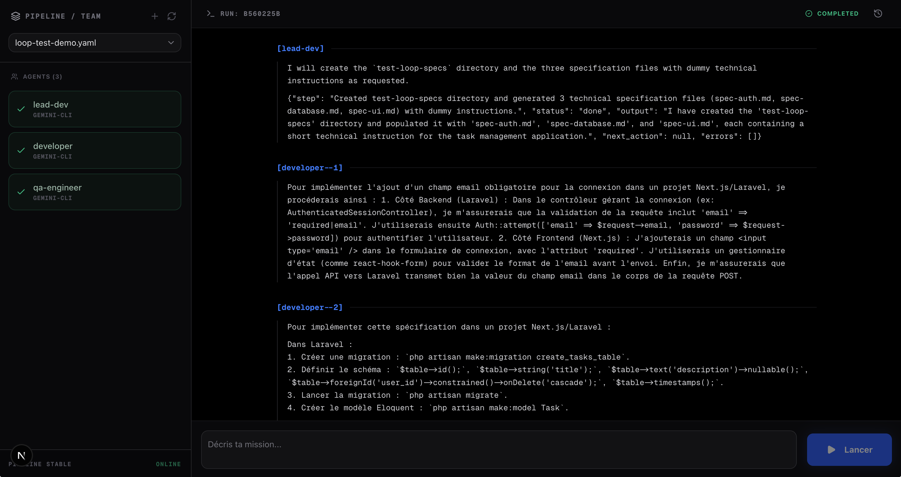
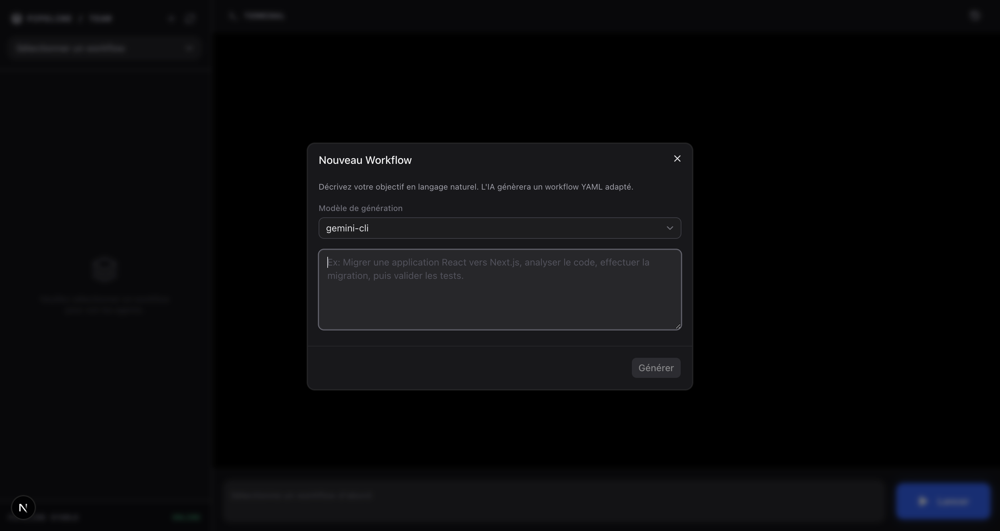
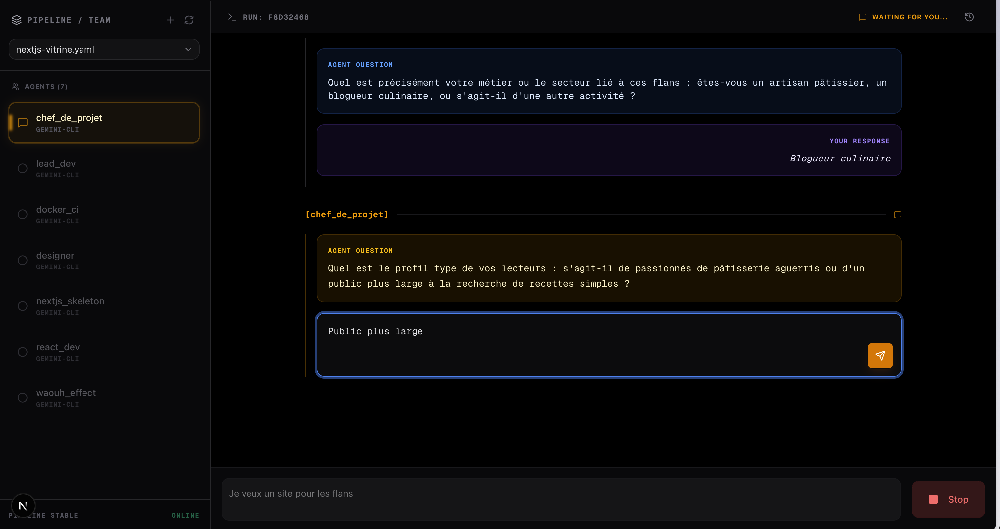
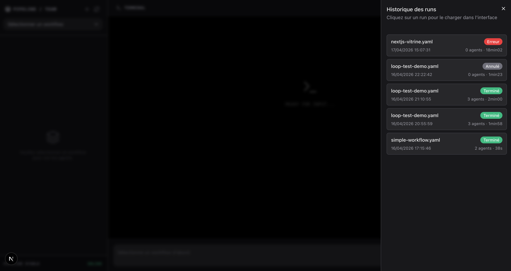

# XuMaestro 🎭

**XuMaestro** is a powerful and flexible workflow orchestrator for AI agents (Gemini & Claude). it allows you to define complex sequences of automated tasks, manage loops over files, include sub-workflows, and track execution in real-time through a modern interface.

---

## 🌟 Features

- **YAML Configuration**: Define your workflows simply in YAML files.
- **AI-Powered Workflow Generation**: Instantly create complex YAML workflows from a simple text description using AI.
- **Multi-Engine Support**: Native support for both `gemini-cli` and `claude-code`.
- **Real-Time Execution**: Follow progress, logs, and agent exchanges via a SSE (Server-Sent Events) stream.
- **Loop System (`loop`)**: Automatically iterate over lists of files using glob patterns.
- **Workflow Composition**: Reuse existing workflows as steps using the `sub-workflow` engine.
- **Interactivity**: Agents can pause execution to ask questions to the user.
- **Resilience & Checkpoints**: Error management, automatic retries (`mandatory` mode), and resumption from the last successful checkpoint.
- **Context Isolation**: Each step enriches the shared context while maintaining clean isolation during loop iterations.

---

## 📸 Screenshots

### Real-Time Execution & Completion

*Track agent progress and view final outputs in real-time.*

### AI-Powered Workflow Generation

*Generate complex YAML workflows instantly from a simple text description.*

### Interactive Agent Questions

*Agents can pause execution to request user input when needed.*

### Execution History

*Browse and review all past runs and their associated artifacts.*

---

## 🚀 Installation

### Prerequisites
- **Docker** and **Docker Compose**
- A Claude Code OAuth token (if using the `claude-code` engine): generate it with `claude setup-token`.
- The `gemini` CLI tool configured locally on your host machine.

### Installation Steps

1. **Clone the project**:
   ```bash
   git clone <repo-url>
   cd xu-workflow
   ```

2. **Backend Configuration**:
   Copy the example file and configure your environment variables.
   ```bash
   cp backend/.env.example backend/.env
   ```
   *Note: Ensure you fill in `CLAUDE_CODE_OAUTH_TOKEN` if you plan to use Claude.*

3. **Launch via Docker**:
   Use the provided Makefile to build and start the services.
   ```bash
   make build
   make up
   ```

4. **Access the Interfaces**:
   - **Frontend**: [http://localhost:3000](http://localhost:3000)
   - **Backend API**: [http://localhost:8000](http://localhost:8000)

---

## 🛠️ Workflow Configuration

Workflows are located in the `./workflows` folder at the root of the project. Here is the configuration detail based on `docs/workflow-yaml-configuration.md`.

### Global Structure
```yaml
name: "My Workflow"
project_path: "/Users/leo/Projects/my-project"
agents:
  - id: my_agent
    engine: gemini-cli
    system_prompt: "You are an expert assistant."
    steps:
      - "Task 1"
      - "Task 2"
```

### Agent Parameters
| Parameter | Type | Default | Description |
| :--- | :--- | :--- | :--- |
| `id` | string | - | Unique identifier for the agent. |
| `engine` | string | - | `gemini-cli`, `claude-code`, or `sub-workflow`. |
| `timeout` | int | 120 | Maximum execution time in seconds. |
| `mandatory` | bool | false | Retries the agent on failure. |
| `max_retries` | int | 0 | Number of retry attempts (if `mandatory: true`). |
| `skippable` | bool | false | Allows the workflow to skip this agent via a signal. |
| `interactive` | bool | false | Allows the agent to ask questions to the user. |

### Advanced Features

#### 🔄 Loops (`loop`)
Execute an agent for each file matching a glob pattern:
```yaml
loop:
  over: "src/**/*.ts"
  as: "file"
system_prompt: "Analyze the file {{ file }}"
```

#### 📦 Sub-workflows
Include another workflow file:
```yaml
engine: sub-workflow
workflow_file: another-workflow.yaml
```

#### 📂 External Prompts
Use prompt files located in `./prompts`:
```yaml
system_prompt_file: "expert-dev.md"
```

---

## 📖 Usage

1. **Place your Workflows**: Add your `.yaml` files to the `/workflows` folder.
2. **Launch a Run**: Select your workflow in the Next.js interface and click "Launch Run".
3. **Interact**: If an agent is in `interactive` mode and asks a question, an input field will appear in the UI for your response.
4. **View Artifacts**: Results for each step are stored in the `./runs` folder as Markdown files.

---

## 🏗️ Project Structure

- `backend/`: Laravel API (Execution engine, process management, SSE).
- `frontend/`: Next.js Dashboard (Real-time visualization, run management).
- `workflows/`: Directory for YAML configuration files.
- `prompts/`: Directory for system prompt templates.
- `runs/`: History and artifacts of executions.

---

## 🛡️ Security

The system mounts your `$HOME` directory into the container to allow CLI tools (`gemini`, `claude`) to access their local configurations. Ensure you trust the workflows you execute.

---
*Developed with ❤️ by Xu.*
