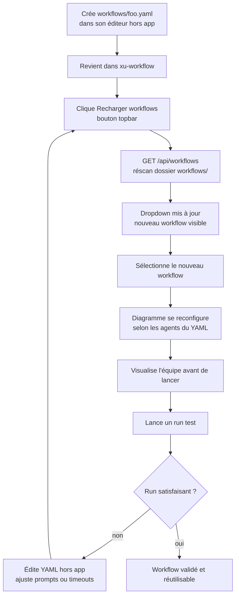

# UX Design Specification — xu-workflow

**Author:** Léo
**Date:** 2026-04-03

---

## Executive Summary

### Vision Projet

xu-workflow est un orchestrateur d'agents IA CLI local, piloté par des fichiers YAML déclaratifs. Il permet à un développeur solo de définir une équipe d'agents spécialisés (Claude Code, Gemini CLI) exécutés en pipeline séquentiel, avec un contexte ciblé par agent. L'application s'installe en localhost, utilisée exclusivement sur Chrome desktop.

Problème résolu : un agent unique sur un contexte partagé grandissant dégrade en qualité sur les tâches complexes — la solution est architecturale, pas un changement de modèle. Chaque agent reçoit exactement ce dont il a besoin, dans l'ordre imposé par le développeur via YAML.

### Utilisateurs Cibles

**Profil unique : développeur solo full-stack (Léo)**

- Développeur quotidien qui utilise Claude Code comme outil principal
- Frustré par la dégradation de qualité des agents sur des tâches à plusieurs étapes
- Besoin de visibilité en temps réel sur ce qui se passe sans lire des logs
- Utilisateur avancé : à l'aise avec YAML, git, CLI — pas besoin d'onboarding simplifié
- Contexte d'usage : bureau, Chrome desktop, localhost uniquement

### Défis de Design Clés

1. **Rendre l'invisible visible** — les opérations CLI headless sont opaques par nature. Traduire en temps réel des processus terminaux en représentation visuelle lisible et immédiatement compréhensible.

2. **États expressifs sans ambiguïté** — 4 états (`idle / working / error / done`) doivent être instantanément distinguables. L'état `error` doit être localisé sur le nœud concerné avec urgence contenue — visible sans être anxiogène pour le reste du diagramme.

3. **Progression satisfaisante sur des runs longs** — un run peut durer 10-20 min. L'UI doit maintenir l'engagement et donner un sentiment d'avancée à chaque transition d'agent, pas juste défiler des logs.

### Opportunités de Design

1. **Le diagramme comme interface principale** — contrairement aux outils concurrents (logs terminal, UI drag-and-drop), xu-workflow peut faire du diagramme d'agents le centre de gravité de toute l'expérience. Un coup d'œil suffit pour comprendre l'état complet du run.

2. **Gamification évolutive** — le MVP commence avec un diagramme classique (nœuds/arêtes), mais l'architecture visuelle peut progressivement évoluer vers un open space pixel art avec personnages animés (Phase 3) sans casser l'UX existante.

3. **YAML comme langage de configuration visuel** — le sélecteur de workflow + rechargement dynamique du diagramme font du fichier YAML un outil de configuration *visuel* : changer le YAML change l'équipe visible dans l'interface en temps réel.

---

## Expérience Utilisateur Core

### Expérience Définissante

L'action principale de xu-workflow est **lancer un run**. Le développeur écrit un brief textuel libre, clique Lancer, et observe son équipe d'agents travailler de façon autonome jusqu'à la complétion — sans intervenir, sans lire des logs, sans surveiller un terminal. La valeur est dans l'autonomie : le workflow s'exécute, le développeur peut se concentrer sur autre chose ou simplement observer.

### Stratégie Plateforme

- **Plateforme :** Web app locale, Chrome desktop uniquement, localhost
- **Interaction :** Souris + clavier. Pas de touch, pas de mobile, pas de multi-device
- **Déploiement :** localhost uniquement — aucune considération SEO, responsive ou accessibilité avancée
- **Contrainte clé :** SSE natif, pas de polyfills — Chrome desktop supporté nativement

### Interactions Effortless

- **Sélection de workflow** → le diagramme se reconfigure instantanément selon le YAML choisi — aucune action supplémentaire requise
- **Lecture de l'état d'un run** → compréhensible d'un seul coup d'œil : qui travaille, qui a fini, qui a planté — sans lire de texte
- **Retry d'une étape en erreur** → un bouton sur la bulle d'alerte, le moteur repart exactement du bon checkpoint — aucune configuration supplémentaire
- **Consultation du log** → la sidebar `.md` append-only est là pour qui veut fouiller, sans perturber la vue diagramme principale

### Moments de Succès Critiques

1. **Premier run complet sans intervention** — c'est la définition littérale du succès selon la PRD. 2+ agents séquentiels qui s'enchaînent sans blocage. Si ce moment arrive sans accroc, la valeur de xu-workflow est démontrée.

2. **La première transition animée entre agents** — le moment où l'utilisateur voit visuellement le contexte "passer" d'un agent à l'autre dans le diagramme. C'est ici que xu-workflow devient différent d'un script terminal.

3. **Le retry partiel après erreur** — timeout déclenché → alerte localisée sur le nœud → retry depuis le bon checkpoint → reprise du workflow. Ce moment valide la robustesse et crée de la confiance dans l'outil.

### Principes d'Expérience

1. **Lisibilité immédiate** — l'état complet du run doit être compréhensible sans lire une seule ligne de texte. Le diagramme est la source de vérité visuelle.

2. **Transparence sans friction** — bulles SSE (fil directeur temps réel) et sidebar `.md` (détail pour qui veut fouiller) coexistent sans que l'un gêne l'autre. Deux niveaux de lecture, une seule interface.

3. **Localisation des erreurs** — une erreur n'est jamais globale. Elle est toujours localisée sur le nœud concerné, avec le contexte suffisant pour agir (message + step + bouton retry), sans polluer les nœuds sains.

4. **Progression tangible** — chaque étape complétée marque une avancée visible. Nœud marqué `done`, flèche activée, bulle de complétion — le run ressemble à une avancée, pas à un chargement opaque.

---

## Réponses Émotionnelles Désirées

### Objectifs Émotionnels Primaires

- **Maîtrise** — l'utilisateur est le chef d'orchestre. Il a défini l'équipe, l'ordre, les prompts. Il voit son intent se déployer de façon autonome. Aucun sentiment de dépendance à une boîte noire.
- **Confiance** — dans la robustesse du moteur. Quand une étape plante, l'alerte est claire et localisée. Quand le retry repart du bon checkpoint, la confiance augmente. Le système ne ment pas, ne cache pas les erreurs.
- **Satisfaction de progression** — chaque nœud qui passe à `done` est une micro-victoire. Le run ressemble à un projet qui avance, pas à un spinner qui tourne.

### Parcours Émotionnel

| Moment | Émotion visée |
|---|---|
| Sélection du workflow + visualisation du diagramme | Anticipation, clarté — "je vois mon équipe" |
| Lancement du run | Engagement — "j'ai déclenché quelque chose de puissant" |
| Première transition agent → agent | Émerveillement — "c'est vraiment autonome" |
| Run long en cours | Calme confiant — on suit sans stress |
| Erreur avec alerte localisée | Contrôle — "je sais exactement ce qui a planté" |
| Retry qui reprend du bon checkpoint | Soulagement + confiance — "le système est robuste" |
| Modal de fin de run | Accomplissement — "4 agents, 0 intervention, c'est fait" |

### Micro-Émotions

- **Confiance vs. Scepticisme** → critique : l'utilisateur doit croire que le moteur fait ce qu'il dit, à chaque étape
- **Contrôle vs. Anxiété** → l'erreur localisée maintient le contrôle ; une erreur globale crée de l'anxiété — à éviter
- **Accomplissement vs. Frustration** → la progression visible via les transitions nœuds → nœuds crée l'accomplissement continu
- **Émerveillement vs. Passivité** → la première transition animée entre agents doit déclencher l'émerveillement, pas la passivité

### Émotions à Éviter

- **Anxiété** — état `error` qui envahit tout l'écran, alarme globale, interface "cassée" → l'erreur est toujours localisée, contenue, récupérable
- **Opacité** — ne pas savoir ce qui se passe, outil qui travaille en silence → contra : bulles SSE + sidebar donnent toujours un fil directeur
- **Passivité** — avoir déclenché quelque chose sans comprendre ce qui avance → contra : chaque transition est rendue visible et lisible

### Implications Design

- **Maîtrise** → le diagramme reflète exactement ce qui est dans le YAML — pas de surprise, pas de magie cachée
- **Confiance** → les erreurs exposent le message, l'étape, et l'action possible — jamais un simple "something went wrong"
- **Satisfaction** → animations de transition entre nœuds, marquage `done` expressif, modal de fin satisfaisante
- **Calme** → palette de couleurs et animations douces — urgence visuelle contenue sur le nœud en erreur uniquement

---

## Analyse UX & Inspiration

### Analyse des Produits Inspirants

**GitHub Actions**
Pipeline visuel avec états clairs par job (pending / running / success / failed) — lisible d'un coup d'œil. Les logs sont accessibles mais pas au premier plan : la vue pipeline est la vue principale. Les erreurs sont localisées sur le job concerné avec accès direct aux logs du job fautif. Progression step-by-step visible dans chaque job expansible.

**Jenkins (Stage View)**
Vue en colonnes : stages = colonnes, état = couleur de case. Chaque stage a un statut coloré immédiatement visible. Accès aux logs par stage en un clic. Clarté de la grille stages/états — chaque agent est un stage, son état est son statut visuel.

**shadcn/ui**
Design épuré, contraste net, typographie claire — pas de décoration inutile. Composants fonctionnels d'abord, esthétiques ensuite. Palette sobre avec accents bien choisis (states : green / red / yellow bien distincts et significatifs).

**JetBrains**
DA dense mais jamais surchargée — beaucoup d'info, parfaitement hiérarchisée. Couleurs fonctionnelles : chaque couleur a un sens précis. Layout split view (panneau principal + détail latéral) sans quitter le contexte. Animations subtiles et rapides — feedback sans distraction.

### Patterns UX Transférables

| Pattern | Source | Application xu-workflow |
|---|---|---|
| Vue pipeline → état par nœud | GitHub Actions + Jenkins | Diagramme avec états visuels immédiats par agent |
| Drill-down accessible | GitHub Actions | Sidebar `.md` comme "logs du job" — accessible sans quitter la vue principale |
| Couleurs sémantiques strictes | JetBrains + shadcn | Vert = done, rouge = error, jaune = working, gris = idle |
| Split view | JetBrains | Diagramme (centre) + sidebar log (droite) |
| Densité sans surcharge | JetBrains | Bulles + états + log sans chaos visuel |
| Composants épurés | shadcn | Base de composants pour tout l'UI — boutons, badges, modales |

### Anti-Patterns à Éviter

- **Logs comme vue principale** (Jenkins sans stage view) — les logs sont le détail, pas la vue principale dans xu-workflow
- **Couleurs décoratives sans sens** — chaque couleur signifie un état précis, aucune couleur purement esthétique
- **Animations lourdes** — les transitions doivent être rapides et lisibles, pas spectaculaires
- **Modales intrusives** — les infos qui peuvent être inline (bulles, badges) ne déclenchent pas de modale

### Stratégie d'Inspiration Design

**À adopter :**
- Layout split view JetBrains (diagramme central + sidebar log)
- États colorés GitHub Actions (localisés sur le nœud, immédiats)
- Composants shadcn comme base UI

**À adapter :**
- Stage view Jenkins → diagramme nœuds/arêtes (plus adapté aux pipelines potentiellement non-linéaires en Phase 2)

**À éviter :**
- Approche "logs d'abord" — le diagramme est toujours au centre
- Complexité visuelle prématurée — MVP sobre, évolutif vers le pixel art en Phase 3

---

## Design System Foundation

### Choix du Design System

**shadcn/ui + Tailwind CSS**

Aligné avec la stack Next.js + TypeScript de la PRD et les préférences d'inspiration exprimées.

### Rationale

- **Solo développeur** — shadcn fournit des composants prêts à l'emploi sans l'overhead d'un système custom
- **Copier-coller, pas une dépendance** — les composants sont dans le codebase, modifiables librement — indispensable pour customiser les états `idle/working/error/done` sur les nœuds du diagramme
- **Tailwind intégré** — cohérent avec `create-next-app`, aucune couche supplémentaire
- **DA sobre par défaut** — correspond à l'inspiration JetBrains, extensible vers le pixel art (Phase 3) sans refactorer l'existant
- **Compatible React 19 / Next.js 16** — maintenu activement, documentation solide

### Composants shadcn Clés

| Composant | Usage |
|---|---|
| `Badge` | État de chaque nœud (idle / working / error / done) |
| `Card` | Carte agent dans le diagramme |
| `Button` | Actions (Lancer, Retry, Annuler) |
| `Textarea` | Champ brief de lancement |
| `Select` | Sélecteur de workflow |
| `Sheet` / `ScrollArea` | Sidebar log `.md` append-only |
| `Dialog` | Modal récapitulatif de fin de run |
| `Alert` | Bulle d'erreur localisée sur le nœud |

### Stratégie de Customisation

- **Tokens couleur sémantiques** définis dans `tailwind.config` : `agent-idle`, `agent-working`, `agent-error`, `agent-done` — utilisés systématiquement pour les états d'agents
- **Composant `AgentNode`** custom construit sur `Card` + `Badge` — réutilisable pour tout agent du diagramme
- **Animations** via Tailwind `animate-pulse` (état error) et transitions CSS sur les arêtes — léger, sans lib d'animation externe pour le MVP
- **Phase 3 pixel art** — le diagramme classique sera remplacé par un canvas PixiJS ; shadcn reste en place pour tous les éléments hors-canvas (sidebar, modales, sélecteur, barre de lancement)

---

## Direction de Design

### Directions Explorées

Six directions ont été générées et visualisées dans `ux-design-directions.html` :

| Direction | Style | Caractéristiques |
|---|---|---|
| A — Pipeline Horizontal | GitHub Actions | Flux gauche→droite, compact, dense |
| B — Stage Columns | Jenkins Stage View | Tableau colonnes/étapes, très dense |
| **C — Cards Spacieux** | **shadcn-native** | **Cards verticales, étapes détaillées — retenu** |
| D — Graph Centré | Canvas libre | Nœuds positionnés, préfigure Phase 3 |
| E — Terminal Focus | Dev tool / monospace | Log au centre, mini pipeline latéral |
| F — Focus Agent | Agent unique au centre | Strip navigation, progressbar globale |

### Direction Retenue : C — Cards Spacieux

Pipeline vertical de cards shadcn. Chaque agent est une `Card` indépendante avec son badge d'état, la liste de ses étapes (avec statut individuel), et une bulle de contexte SSE inline sous la card active. Les cards sont reliées par des connecteurs verticaux.

### Rationale

- **shadcn-native** — les composants `Card`, `Badge`, `Separator` sont utilisés tels quels sans customisation lourde pour le MVP
- **Détail des étapes visible** — chaque step est lisible directement dans la card, sans drill-down — aligné avec le principe "lisibilité immédiate"
- **Évolutif vers Phase 3** — le pipeline vertical de cards peut être progressivement remplacé par un canvas pixel art sans toucher à la sidebar, la barre de lancement ou les modales
- **Densité adaptée** — ni trop compact (direction B) ni trop épuré (direction F) — correspond au profil utilisateur développeur qui veut l'info disponible sans être surchargé

### Approche d'Implémentation

- Composant `AgentCard` : `Card` + header (nom + engine + `Badge` état) + liste de `StepItem` + `BubbleBox` conditionnelle
- Connecteurs : `Separator` vertical avec couleur conditionnelle (`agent-done` si arête activée)
- Pipeline : `flex-col` avec `gap-0`, max-width centré dans la zone diagramme
- Sidebar : `Sheet` ou `div` fixe à droite avec `ScrollArea` pour le log `.md`
- Barre de lancement : `Textarea` + `Button` fixés en bas (`sticky bottom-0`)

---

## Expérience Définissante

### 2.1 Définition

> **"Lancer un run et regarder son équipe d'agents travailler."**

Pas déclencher un script — voir en temps réel, visuellement, chaque agent recevoir sa tâche, travailler, passer le relais au suivant, jusqu'à la complétion complète sans aucune intervention.

### 2.2 Modèle Mental Utilisateur

L'utilisateur arrive avec l'habitude de Claude Code solo : un prompt long, une attente, le risque de dérailler à mi-chemin. Le modèle mental importé dans xu-workflow : *"je confie une mission à une équipe, pas à un individu"*. Chaque agent a un rôle précis et un contexte propre. xu-workflow rend ce découpage visible au lieu de le cacher dans un terminal.

Frustrations du modèle précédent résolues :
- **Opacité** → bulles SSE + diagramme d'états en temps réel
- **Dégradation silencieuse** → contrat JSON validé + erreur surfacée immédiatement sur le nœud
- **Absence de reprise partielle** → checkpoint step-level + retry depuis le bon point

### 2.3 Critères de Succès

- Le diagramme se met à jour **sans action utilisateur** — les transitions sont poussées (SSE), pas tirées (polling)
- L'état de chaque agent est **lisible sans lire** — couleur + badge suffisent, aucun texte requis
- Une erreur n'interrompt **pas la compréhension globale** — le reste du diagramme reste stable et lisible
- Le retry est **à un clic** depuis la bulle d'erreur, sans navigation supplémentaire

### 2.4 Patterns UX — Établis et Innovants

**Patterns établis (pas d'éducation utilisateur nécessaire) :**
- Pipeline visuel avec états par nœud — connu de GitHub Actions / Jenkins
- Logs accessibles en sidebar — connu de tout outil CI/CD
- Modal de fin récapitulatif — pattern universel

**Innovation ciblée :**
- **Transitions animées entre agents** — le handoff est visible dans le diagramme (arête activée, animation de passage) — inexistant dans les outils CI/CD classiques
- **Bulles SSE associées au nœud actif** — pas un log global, une narration localisée sur l'agent qui travaille

### 2.5 Mécanique de l'Expérience Core

**Lancer un run — flux complet :**

1. **Initiation** — sélecteur de workflow en haut → diagramme se reconfigure → textarea brief en bas → bouton "Lancer"
2. **Interaction** — premier nœud passe à `working`, bulle SSE apparaît au-dessus du nœud actif avec l'étape en cours ; sidebar `.md` commence à s'enrichir
3. **Feedback de transition** — à chaque handoff : nœud précédent → `done` (vert), arête → activée visuellement, nœud suivant → `working` (transition animée)
4. **Complétion** — modal central : agents exécutés, durée totale, statut, lien vers le dossier run

**Flux erreur :**
1. Nœud concerné → `error` (rouge, `animate-pulse`)
2. Bulle d'alerte localisée sur le nœud : message d'erreur + étape concernée + bouton "Relancer cette étape"
3. Le reste du diagramme reste stable — aucune perturbation des nœuds sains
4. Retry → recharge depuis le dernier checkpoint, relance uniquement l'étape fautive

---

## Parcours Utilisateurs — Flows Détaillés

### Journey 1 — Run Complet Séquentiel (Happy Path)

```mermaid
flowchart TD
    A[Ouvre xu-workflow] --> B[Sélectionne workflow YAML\ndropdown topbar]
    B --> C[Diagramme se reconfigure\ncards agents en séquence]
    C --> D[Écrit brief dans textarea\nbarre de lancement en bas]
    D --> E[Clique Lancer]
    E --> F[POST /api/runs\n{workflow, brief}]
    F --> G[SSE stream ouvert]
    G --> H[Card Agent 1 → working\nbadge + step 1 activé]
    H --> I[Bulle SSE inline sous la card\nétape en cours visible]
    I --> J{Agent 1 terminé ?}
    J -- oui --> K[Card Agent 1 → done\nConnecteur → activé bleu]
    K --> L[Card Agent 2 → working\nTransition animée]
    L --> M[...répétition pour chaque agent]
    M --> N[Tous agents done]
    N --> O[Modal récapitulatif\nagents · durée · statut · lien dossier run]
    O --> P[Fin — dossier runs/ disponible]
```

### Journey 2 — Run qui Déraille (Edge Case)

```mermaid
flowchart TD
    A[Run en cours — agent N working] --> B{Timeout ou erreur CLI}
    B --> C[Card Agent N → error\nbadge rouge + animate-pulse]
    C --> D[Bulle d'alerte inline\nmessage + étape + bouton Retry]
    D --> E[Utilisateur lit l'erreur]
    E --> F[Clique Relancer cette étape]
    F --> G[POST /api/runs/{id}/retry-step]
    G --> H[Moteur recharge contexte\njusqu'au dernier checkpoint]
    H --> I[Card Agent N → working\nstep fautif relancé]
    I --> J{Retry réussit ?}
    J -- oui --> K[Step → done\nWorkflow reprend normalement]
    J -- non et max_retries atteint --> L[Card → error permanent\nMessage : max retries atteint]
    K --> M[Pipeline continue]
```

### Journey 3 — Configurer un Nouveau Workflow



### Patterns de Parcours

**Navigation :** topbar = sélection + contrôles globaux · diagramme = zone d'observation · barre basse = déclenchement

**Feedback :** badge état toujours visible sur chaque card · bulle SSE = fil directeur temps réel · sidebar = détail optionnel

**Erreur :** toujours localisée sur la card concernée · toujours actionnable (bouton retry dans la bulle) · jamais globale ni bloquante pour la lecture du diagramme

**Progression :** connecteur inactif → actif (bleu) à chaque handoff · card précédente → done (vert) avant d'activer la suivante

### Principes d'Optimisation des Flows

- **Zéro navigation supplémentaire pour le retry** — bouton dans la bulle d'alerte, en place, sans changer de vue
- **Rechargement YAML sans redémarrage** — bouton dédié dans la topbar, résultat visible immédiatement dans le diagramme
- **Confirmation de fin non-bloquante** — la modal récapitulatif peut être fermée, le dossier run reste accessible ultérieurement
- **Pas d'état intermédiaire ambigu** — une card est toujours dans l'un des 4 états explicites (idle / working / done / error), jamais dans un état indéterminé

---

## Stratégie de Composants

### Composants shadcn — Couverture Directe

| Composant shadcn | Usage xu-workflow |
|---|---|
| `Card` | Base de chaque `AgentCard` |
| `Badge` | État agent (idle / working / done / error) |
| `Button` | Lancer, Retry, Annuler, Recharger |
| `Textarea` | Champ brief de lancement |
| `Select` + `SelectItem` | Sélecteur de workflow |
| `ScrollArea` | Sidebar log `.md` append-only |
| `Dialog` | Modal récapitulatif de fin de run |
| `Alert` | Modèle visuel pour `BubbleBox` |
| `Separator` | Base des connecteurs inter-cards |
| `Tooltip` | Info au survol (engine, timeout) |

### Composants Custom

#### `AgentCard`
**But :** Représentation visuelle d'un agent dans le pipeline.
**Base :** `Card` shadcn.
**Anatomie :** header (nom + engine + `Badge` état) + corps (`StepList`) + footer conditionnel (`BubbleBox`).
**États :** `idle` (opacité 45%) · `working` (border blue-500, box-shadow) · `done` (border emerald-500, opacité 70%) · `error` (border red-500, animate-pulse).
**Props :** `name`, `engine`, `status`, `steps[]`, `bubble?`.

#### `StepItem`
**But :** Ligne individuelle d'étape au sein d'une `AgentCard`.
**Anatomie :** icône état (✓ / ⚙ / ○ / ✗) + libellé + durée optionnelle.
**États :** `pending` · `working` · `done` · `error`.

#### `PipelineConnector`
**But :** Lien vertical entre deux `AgentCard` consécutives.
**Base :** `Separator` vertical shadcn.
**États :** `inactive` (zinc-700) · `active` (blue-400) · `done` (emerald-500).
**Animation :** transition `background-color` 300ms au changement d'état.

#### `BubbleBox`
**But :** Bulle SSE inline affichée sous la card active.
**Variantes :** `info` (bleu, étape en cours) · `error` (rouge, message + bouton Retry) · `success` (vert, complétion).
**Contenu :** message texte + bouton action conditionnel (Retry pour variante error).

#### `RunSummaryModal`
**But :** Récapitulatif affiché automatiquement à la fin d'un run.
**Base :** `Dialog` shadcn.
**Contenu :** stats globales (nb agents, durée, statut) + liste agents avec statut individuel + lien vers le dossier run.

#### `LaunchBar`
**But :** Barre de lancement fixée en bas de l'interface, toujours visible.
**Base :** `Textarea` + `Button` dans un `div` sticky.
**États :** `ready` (prêt à lancer) · `running` (textarea disabled, bouton Annuler actif) · `disabled` (aucun workflow sélectionné).

### Stratégie d'Implémentation

- Tous les composants custom sont construits sur les tokens Tailwind (`agent-idle`, `agent-working`, `agent-done`, `agent-error`) définis dans `tailwind.config`
- Aucune lib d'animation externe pour le MVP — Tailwind `animate-pulse` + transitions CSS suffisent
- Les composants hors-diagramme (sidebar, modales, sélecteur, barre) sont découplés du canvas — compatibles Phase 3

### Roadmap Composants

**Phase 1 MVP core :** `AgentCard` · `StepItem` · `PipelineConnector` · `BubbleBox` (variante info) · `LaunchBar`

**Phase 1 MVP complet :** `BubbleBox` variante error + Retry · `RunSummaryModal`

**Phase 2 :** Animations `PipelineConnector` (transition active) · `AgentCard` animations handoff · `Tooltip` sur cards

**Phase 3 :** Remplacement `AgentCard` + `PipelineConnector` par canvas PixiJS — tous les autres composants inchangés

---

## Patterns UX de Cohérence

### Hiérarchie des Boutons

| Niveau | Composant shadcn | Usage |
|---|---|---|
| Primaire | `Button` (default — bleu) | Lancer un run — action principale unique |
| Secondaire | `Button variant="outline"` | Recharger workflows, Annuler un run |
| Destructif | `Button variant="destructive"` | Annuler un run en cours uniquement |
| Action inline | `Button variant="ghost" size="sm"` | Retry dans une `BubbleBox` error |

**Règle :** une seule action primaire visible à la fois — "Lancer" (idle) ou "Annuler" (run actif), jamais les deux simultanément.

### Patterns de Feedback

| Situation | Composant | Comportement |
|---|---|---|
| Agent working | `Badge working` + `BubbleBox info` | Inline sur la card, mis à jour par SSE |
| Agent done | `Badge done` + `PipelineConnector` activé | Transition visuelle immédiate |
| Agent error | `Badge error` + `BubbleBox error` + `animate-pulse` | Localisé sur la card, bouton Retry |
| Fin de run | `RunSummaryModal` | Auto-ouverture, fermable |
| Chargement YAML | Skeleton shadcn sur les cards | Pendant la récupération initiale |

**Règle :** aucun toast global — tout feedback est localisé sur l'élément concerné.

### Patterns de Formulaire

Un seul champ de saisie dans l'app : le brief de lancement.

- `Textarea` avec `resize="none"`, hauteur fixe — pas de redimensionnement
- Placeholder : *"Décris la tâche à confier à l'équipe..."*
- Disabled pendant un run actif (grisé visuellement)
- Pas de validation client — validation côté Laravel (brief non-vide, YAML valide)

### Patterns de Navigation

- **Topbar uniquement :** sélecteur workflow + bouton Recharger + indicateur de run actif
- **SPA mono-vue :** pas de routing entre pages, vue unique et constante
- **Pas de breadcrumbs, tabs ou menus secondaires** en MVP

### États Vides & Chargement

| État | Pattern |
|---|---|
| Aucun workflow chargé | Message centré dans la zone diagramme + instruction |
| Workflow sélectionné, pas de run | Diagramme statique, toutes cards en `idle` |
| Chargement liste workflows | `Select` disabled + spinner dans le bouton Recharger |
| Run annulé | Cards dans dernier état connu + badge "annulé" |

### Modales & Overlays

- **`RunSummaryModal`** : seule modale — auto-déclenchée à la fin du run, fermable via `Escape` ou ×
- **Pas de drawers ni popovers** : la sidebar est une zone fixe, pas un overlay
- **Tooltips** uniquement pour les infos secondaires (engine, timeout) au survol des cards

---

## Responsive Design & Accessibilité

### Stratégie Responsive

**Périmètre :** Chrome desktop uniquement, largeur minimum ~1280px. Pas de support mobile ou tablet.

| Largeur | Comportement |
|---|---|
| < 1024px | Sidebar log masquée, diagramme pleine largeur |
| 1024–1600px | Layout nominal — diagramme `flex-1` + sidebar `w-80` |
| > 1600px | Max-width sur le pipeline de cards (`max-w-2xl` centré) |

**Breakpoints :** un seul breakpoint utile — `lg` (1024px). En dessous, la sidebar disparaît et le diagramme prend toute la largeur.

### Stratégie Accessibilité

**Cible :** WCAG AA partiel — pragmatique pour un dev tool personnel.

**Implémenté :**
- Contraste WCAG AA sur tous les textes principaux (ratio ≥ 4.5:1 sur fond dark)
- États agents non-couleur-dépendants — badge texte toujours présent en complément de la couleur
- Navigation clavier fonctionnelle sur tous les éléments interactifs (boutons, select, textarea)
- Focus visible sur tous les éléments interactifs (shadcn par défaut)
- ARIA labels sur les boutons dont le sens n'est pas dans le texte (ex : bouton Retry associé à son agent)

**Hors scope :**
- Support screen reader complet — pas de cas d'usage identifié
- Touch targets 44px — desktop uniquement, sans touch
- Mode contraste élevé — au-delà des besoins actuels

### Guidelines d'Implémentation

- **Unités :** `rem` pour les tailles de police, `px` pour les espacements (shadcn par défaut)
- **Layout :** `flex` et `grid` Tailwind — `position: fixed` uniquement pour la `LaunchBar` et la topbar
- **Navigation clavier :** `Tab` — topbar → éléments interactifs du diagramme → sidebar → `LaunchBar`
- **Pas de skip links** — app mono-vue sans long contenu à enjamber

---

## Fondations Visuelles

### Système de Couleurs

**Mode :** Dark mode — cohérent avec l'usage dev tool (JetBrains, GitHub Actions en dark par défaut)

**Couleurs sémantiques d'états agents — pivot du système :**

| Token | Couleur Tailwind | Usage |
|---|---|---|
| `agent-idle` | `zinc-500` | Nœud en attente |
| `agent-working` | `blue-500` | Nœud actif, en cours |
| `agent-done` | `emerald-500` | Nœud complété |
| `agent-error` | `red-500` + `animate-pulse` | Nœud en erreur |

**Palette de base :**

| Rôle | Couleur Tailwind | Usage |
|---|---|---|
| Background | `zinc-950` / `zinc-900` | Fond application |
| Surface | `zinc-800` | Cards, sidebar |
| Border | `zinc-700` | Séparateurs, arêtes inactives |
| Edge active | `blue-400` | Arête activée lors d'un handoff |
| Text primary | `zinc-100` | Titres, labels |
| Text secondary | `zinc-400` | Timestamps, metadata |

### Système Typographique

- **Police principale :** `Geist` (intégrée Next.js par défaut) — sobre, lisible, moderne. Fallback : `Inter`
- **Scale :**
  - Noms d'agents dans le diagramme : 14px / weight 500
  - Corps de texte (bulles, sidebar) : 14px / weight 400
  - Outputs CLI dans la sidebar : 13px mono (`font-mono`)
  - Labels d'état badges : 12px / weight 500
- **Poids :** 500 pour les labels d'états et titres, 400 pour le corps de texte

### Espacement & Layout

- **Unité de base :** 4px (système Tailwind standard)
- **Layout principal :** 2 colonnes
  - Zone diagramme : `flex-1` (~70% largeur) — centre de gravité visuel
  - Sidebar log `.md` : `w-80` (~30% largeur) — accessible, non intrusif
- **Barre de lancement :** fixée en bas (`fixed bottom-0`), hauteur ~80px, toujours visible pendant un run
- **Densité :** moyenne — nœuds avec padding suffisant pour lisibilité immédiate, pas d'espace excessif

### Considérations Accessibilité

- **Périmètre :** Chrome desktop uniquement, usage personnel — contraintes légères
- **Contraste :** WCAG AA sur les textes principaux (ratio ≥ 4.5:1 sur fond dark)
- **États non-couleur-dépendants :** chaque état agent combine couleur + badge texte (`idle` / `working` / `done` / `error`) — jamais la couleur seule comme seul signal

